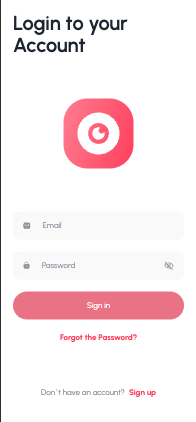
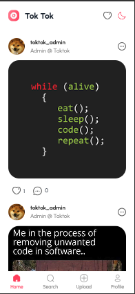
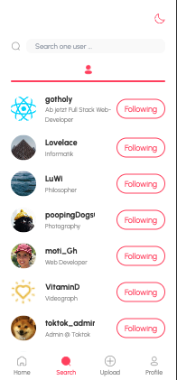
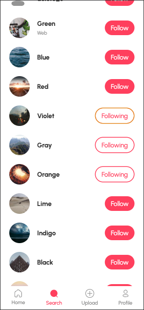
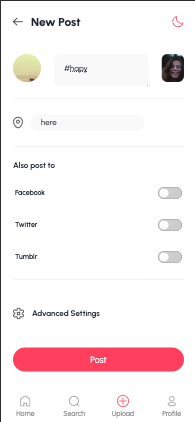

# TOKTOK - Fullstack Sozial Media App (node, express, vite+react, tailwind(daisyui) - light/dark)

# ENGLISH (german below):

# Fullstack Bootcamp final project :

TokTok allows you to upload photos, follow other users and "like" or comment on their posts.
It's a platform where you can share your personality and interests with the world and make new contacts.

It is a clone of the well-known social network for uploading photos and commenting on photos, although the name does not refer to the Asian social network for uploading videos.

[Deployment](https://toktok-ny7a.onrender.com/loading)

[Andres Presentation](./readmeAssets/toktok.pdf)

[figJam](https://www.figma.com/file/yGKTxXbf7onpoeiQWSkdfi/toktok?type=whiteboard&node-id=0-1&t=gTKaZP3JHPnkK1fU-0)

[Figma Design](https://www.figma.com/file/HcS8mvAp057ohNAnex4rmQ/TokTok?type=design&node-id=0-1&mode=design&t=dzqLOnd7vEpvwOUj-0)

[Figma Prototyp](https://www.figma.com/proto/HcS8mvAp057ohNAnex4rmQ/TokTok?node-id=1-2171&scaling=min-zoom&page-id=0%3A1&starting-point-node-id=1%3A2171)

[Old Frontend Repo](https://github.com/MariaRiosNavarro/toktok_frontend)

# Team:

# Team Backend:

[Melina GitHub](https://github.com/Melina412)

[Andre GitHub](https://github.com/gotholy)

# Team Frontend:

[Moti GitHub](https://github.com/epiDevi)

[Maria GitHub](https://github.com/MariaRiosNavarro)

### All requirements fulfilled:

-Own database (mongoose, Mongo DB Atlas).

-The website is designed for mobile devices (mobilefirst, tailwind).

-It is possible to register, log in and log out.

-You can also upload and publish contributions.

-It is now possible to comment on posts that have already been created.

-It is also possible to add favorites.

-Your application is deploy (render).

### Extras added:

-Comments on comments (replies) with profile image

-Dark mode

-Edit own profile with new photo or data

-Added extra page to show all favorites together (not just add)

### Planned for V.02:

### Priority 1

- Deletion of posts
- Photo upload with camera
- Click on followers & following in the profile
- Tests (unit and integration)
- Delete users and posts from the database with all links in other data

### Priority 2

- Delete and edit comments

### Priority 3

- Change password and email with email authentication.

## Tools :

-node.js + express

-npm : bcrptjs, cloudinary, cookie-parser,cors,dotenv,express-rate-limit,jsonwebtoken, lodash,morgan,multer,nodemailer

-mongoose, mongoDB, MongoDB-Atlas, mongo-compass

-React+vite: tailwind, daisyui

- Other tools:

- Git + GitHub

- render

- Discord, Figma (Design + Figjam), Canva

# Development

We started by creating 2 repositories and realized during deployment the problem of authorization cookies with 2 different domains, so we decided to merge a frontend and a backend project.

The original frontend repository (and its history) is located in (34 PR):

[ First toktok_frontend](https://github.com/MariaRiosNavarro/toktok_frontend)

In the frontend repository we originally had 34 Pull Request and in the unified repository we made 53, so a total of 87 PR in 2 weeks.

# How to set it up

- Download this project (ZIP)

- Install all dependencies: npm install

- Create an .env file in the root directory and add environment variables that are specified in .env.example

```
PORT=
MONGO_ATLAS_URI=

JWT_SECRET=

CLOUDINARY_CLOUD_NAME=
CLOUDINARY_API_KEY=
CLOUDINARY_SECRET=

ALLOWED_ORIGIN=

MAILTRAP_USER=
MAILTRAP_PASSWORD=


```

- Create an .env.local file in the frontend directory and add environment variables to it that are specified in .env.example in /frontend

```
VITE_BACKEND_URL=
```

- Run the app in: npm run serve

- Have fun under your entered PORT in .env

---

# IMAGES:

## Login & Register

<div>




</div>

## Home, search & follow Users

<div>





</div>

## Upload & Post Detail, comment & User

<div>





</div>

# DEUTSCH:

# Fullstack Bootcamp Abschlussprojekt :

Mit TokTok kannst du Fotos hochladen, anderen Nutzern folgen und deren Beiträge "mögen" oder kommentieren.
Es ist eine Plattform, auf der du deine Persönlichkeit und deine Interessen mit der Welt teilen und neue Kontakte knüpfen kannst.

Es handelt sich um einen Klon des bekannten sozialen Netzwerks für das Hochladen von Fotos und das Kommentieren von Fotos, obwohl der Name nicht auf das asiatische soziale Netzwerk für das Hochladen von Videos verweist.

[Deployment](https://toktok-ny7a.onrender.com/loading)

[Andres Präsentation](./readmeAssets/toktok.pdf)

[figJam](https://www.figma.com/file/yGKTxXbf7onpoeiQWSkdfi/toktok?type=whiteboard&node-id=0-1&t=gTKaZP3JHPnkK1fU-0)

[Figma Design](https://www.figma.com/file/HcS8mvAp057ohNAnex4rmQ/TokTok?type=design&node-id=0-1&mode=design&t=dzqLOnd7vEpvwOUj-0)

[Figma Prototyp](https://www.figma.com/proto/HcS8mvAp057ohNAnex4rmQ/TokTok?node-id=1-2171&scaling=min-zoom&page-id=0%3A1&starting-point-node-id=1%3A2171)

[Old Frontend Repo](https://github.com/MariaRiosNavarro/toktok_frontend)

### Alle Anforderungen erfüllt:

-Eigene Datenbank (mongoose, Mongo DB Atlas).

-Die Website ist für mobile Geräte ausgelegt (mobilefirst, tailwind).

-Es ist möglich, sich zu registrieren, an- und abzumelden.

-Sie können auch Beiträge hochladen und veröffentlichen.

-Es ist nun möglich, bereits erstellte Beiträge zu kommentieren.

-Es ist auch möglich, Favoriten hinzuzufügen.

-Ihre Anwendung ist bereitgestellt (render).

### Extras hinzugefügt:

-Kommentare auf Kommentare (reply) mit Profilbild

-Dunkler Modus

-Eigenes Profil mit neuem Foto oder Daten bearbeiten

-Zusätzliche Seite hinzugefügt, um alle Favoriten zusammen anzuzeigen (nicht nur hinzufügen)

### Geplant für V.02:

### Priorität 1

- Löschung von Beiträgen

- Foto-Upload mit Kamera

- Klick auf Follower & Following im Profil

- Tests (Einheit und Integration)

- Löschen von Benutzern und Beiträgen aus der Datenbank mit allen Verknüpfungen in anderen Daten

### Priorität 2

- Kommentare löschen und bearbeiten

### Priorität 3

- Passwort und E-Mail mit E-Mail-Authentifizierung ändern.

## Tools :

-node.js + express

-npm : bcrptjs, cloudinary, cookie-parser,cors,dotenv,express-rate-limit,sonwebtoken, lodash,morgan,multer,nodemailer

-mongoose, mongoDB, MongoDB-Atlas, mongo-compass

-React+vite: tailwind, daisyui

- Andere Tools:

- Git + GitHub

- render

- Discord, Figma (Design + Figjam), Canva

# Entwicklung

Wir begannen mit der Erstellung von 2 Repositories und erkannten beim Deployment das Problem der Autorisierungs-Cookies mit 2 verschiedenen Domains, so dass wir beschlossen, ein Frontend- und ein Backend-Projekt zu vereinen.

Das ursprüngliche Frontend-Repository (und seine Geschichte) befindet sich vor der Zusammenführung in diesem Projekt in :

[ Erste toktok_frontend](https://github.com/MariaRiosNavarro/toktok_frontend)

Im Frontend-Repository hatten wir ursprünglich 34 Pull Request und im Unified Repository haben wir 53 gemacht, also insgesamt 87 PR in 2 Wochen.

# How to set it up

- Download this project (ZIP)

- Installieren Sie alle Abhängigkeiten: npm install

- Erstellen Sie ein .env Datei im Hauptverzeichnis und fügen Sie darin Umgebungsvariablen die in .env.example vorgegeben sind

```
PORT=
MONGO_ATLAS_URI=

JWT_SECRET=

CLOUDINARY_CLOUD_NAME=
CLOUDINARY_API_KEY=
CLOUDINARY_SECRET=

ALLOWED_ORIGIN=

MAILTRAP_USER=
MAILTRAP_PASSWORD=


```

- Erstellen Sie ein .env.local Datei im den verzeichniss frontend und fügen Sie darin Umgebungsvariablen die in .env.example in /frontend vorgegeben sind

```
VITE_BACKEND_URL=
```

- App im ausführen: npm run serve

- Viel Spaß unter ihre eingegebene PORT in .env
